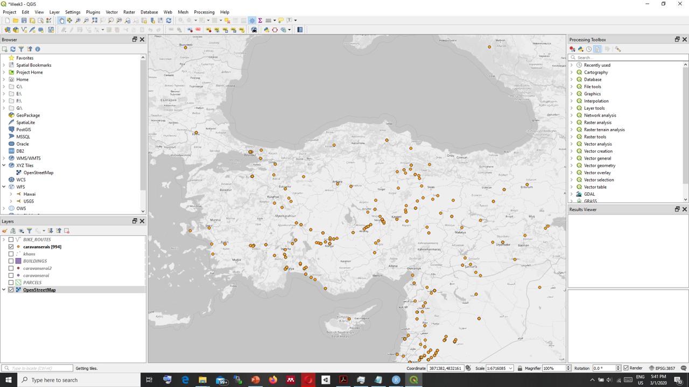

# Quick Start to QGIS

## Installing QGIS

There are two options for installation:  
* OSGeo4  
* Standalone Installer  

## Familiarizing yourself with QGIS Desktop

 

1. Menu Bar
2. Toolbars
3. Panel
4. Map Canvas
5. Status Bar

