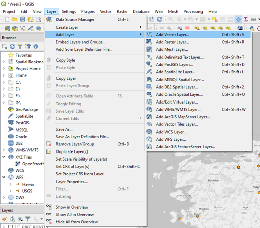

# Vector Data

## Types of vector data in QGIS

* Points
* Lines
* Polygons

>layer > add layer > add vector layer

 

- File
- Folder
- Database
- Protocol

Files that can be loaded as vector files:

- Geopackage
- ESRI Shapefile
- Geography Markup Language
- CSV
- ...

WFS data example:
https://mrdata.usgs.gov/services/wfs/ofr20051294?request=GetCapabilities&service=WFS&version=1.1.0

