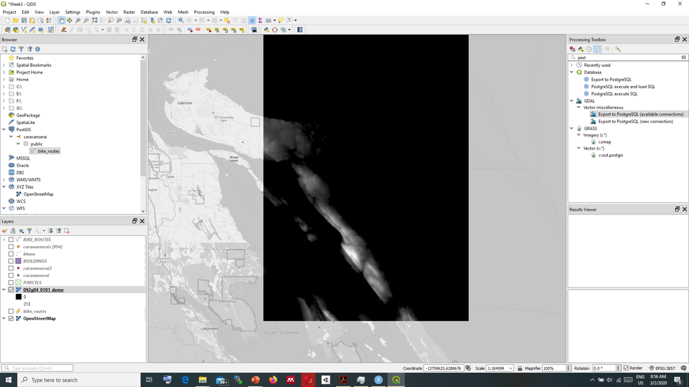
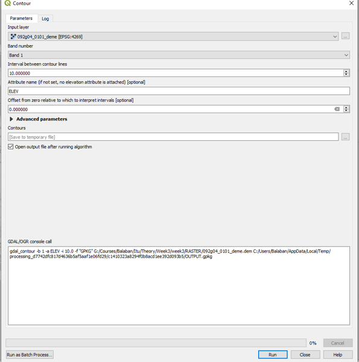
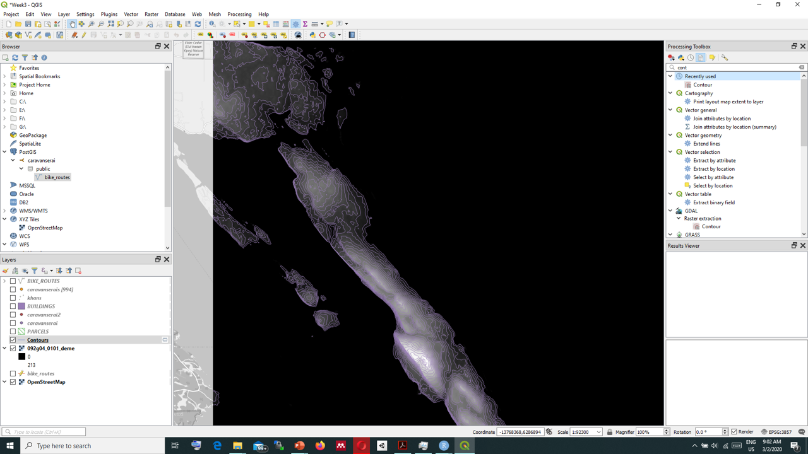

# Raster Data

- Image based
- Georeferencing
- TIFF

>layer > add layer > add Raster layer

## CRS - Coordinate Reference Systems

- 4326 – Google Earth
  * Degrees – lat long
  * globe
- 3857 – Google Maps
  * Meters 
  * map
- Many others 

## Raster File types 

### WMS
WMS - Web map services:
https://mrdata.usgs.gov/services/ofr20051294?request=GetCapabilities&service=WMS&version=1.3.0

### DEM - Digital Elevation Model

DEM is special satellite image that represents elevation of the terrain in a raster graphic. Every pixel value represents elevation on the terrain.

 

We can add DEM images similar to other raster files.

We can convert raster DEM files to vector contour lines. 

>GDAL>Raster extraction>Contour

 

 
