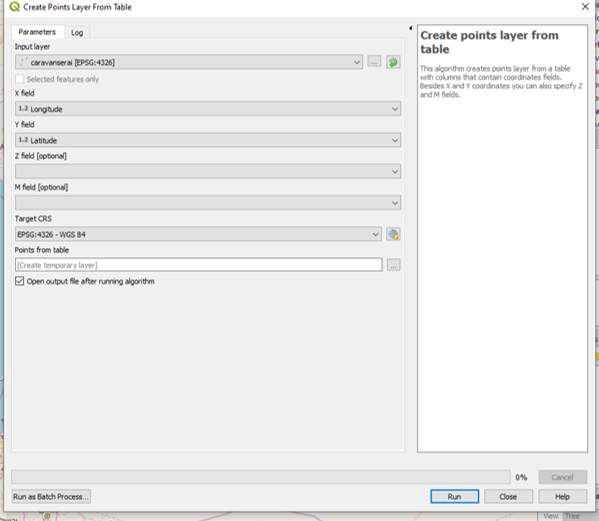

# Assignment

You have been collecting data from the written resources.The primary resources were:

- International database on caravanserais, OWTRAD
- Academic publications, ACUN, ERDMANN, ILTER, CEKUL, etc..
- Websites by travelers, TURKISHHANS

You have been using QGIS, Google Earth, Gsheet, Gdrive to structure the data. As our approach is rather Geotemporal, for the next step, you will be using the central database of QGIS.

Next step will to explore the ACCURACY of the data:

- Level 1: REGISTERED HISTORICAL BUILDINGS (TESCILLI BINALAR) by Ministry of Culture and Tourism, State Museums/Sites (Müzeler ve Ören Yerleri), Local Authorities (Belediyeler): 

  + https://www.kulturportali.gov.tr/
  + https://muze.gov.tr/muzeler


- Level 2: Researched Historical Buildings by  Local and Academic Authorities.
ÇEKÜL: https://www.cekulvakfi.org.tr/
International Universities
Local/National Universities

- Level 3: Travelers, Touristic Informations, Locals
- Level 4: Digital Tools and Methods


```{r results = 'asis', echo=FALSE}
n = c(1, 2, 3, 4, 5, 6, 7, 8, 9, 10, 11, 12) 
location = c("Bursa - Konya", "Denizli- Alanya- Konya", "Mersin - Aksaray- Konya", "Konya - Aksaray - Nevşehir", "Sakarya - Kayseri- Sivas", "Sinop - Sivas - Malatya", "Urfa - Kayseri", "Mardin - Sivas", "Iğdır - Sivas", "", "", "") 
name = c("AYS", "TAN", "NUR", "BEG", "SUM", "VAR", "CEM", "FEY-GUL", "SEN", "SAT", "NIM", "SEP") 
df = data.frame(n, location, name) 
knitr::kable(df, caption = "Assigned Areas")
```


## Collecting the data & Creating the layer

First step for this assignment is to gather the location info for the caravanserais that you are assigned. 

Create a GeoPackage layer.

>Layer\>Create Layer\>New GeoPackage Layer...

 

After creating an empty geopackage layer, we are going to create our caravanserais as points. 

Right click on the created layer and select **Open Attribute Table**.

Here you can see our empty table we need to create as many fields as we require. We will at least require Name field as text and Longitude and Latitude as decimal fields. In this table to edit the layer we need to click on the **Toggle Editing mode** icon. Enter the fields with the collected data.

 

 After creating all the features in our table we need to create the point geometries that is on the coordinates that we entered. For this, we are going to use **Create points layer from table** from processing toolbox.
 
  

After creating an empty geopackage layer, we are going to create our caravanserais as points. 

Right click on the created layer and select **Open Attribute Table**.

Here you can see our empty table we need to create as many fields as we require. We will at least require Name field as text and Longitude and Latitude as decimal fields. In this table to edit the layer we need to click on the **Toggle Editing mode** icon. Enter the fields with the collected data.

 

