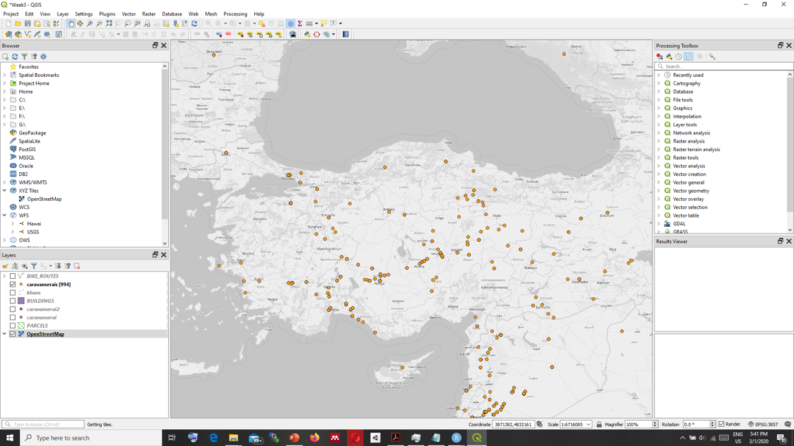

--- 
title: "MBL617 Theory and Methods in Digital Heritage"
author: "Özgün Balaban Güzden Varinlioğlu"
site: bookdown::bookdown_site
output: bookdown::gitbook
documentclass: book
bibliography: [book.bib, packages.bib]
biblio-style: apalike
link-citations: yes
github-repo: rstudio/bookdown-demo
description: "MBL617 Lecture Notes"
---
# QGIS {#intro}

## Installing QGIS

There are two options for installation:  
* OSGeo4  
* Standalone Installer  


### Familiarizing yourself with QGIS Desktop

 

1. Menu Bar
2. Toolbars
3. Panel
4. Map Canvas
5. Status Bar


## Vector Data

### Types of vector data in QGIS

* Points
* Lines
* Polygons

>layer > add layer > add vector layer
File
Folder
Database
Protocol


## Raster Data


```{r include=FALSE}
# automatically create a bib database for R packages
knitr::write_bib(c(
  .packages(), 'bookdown', 'knitr', 'rmarkdown'
), 'packages.bib')
```
